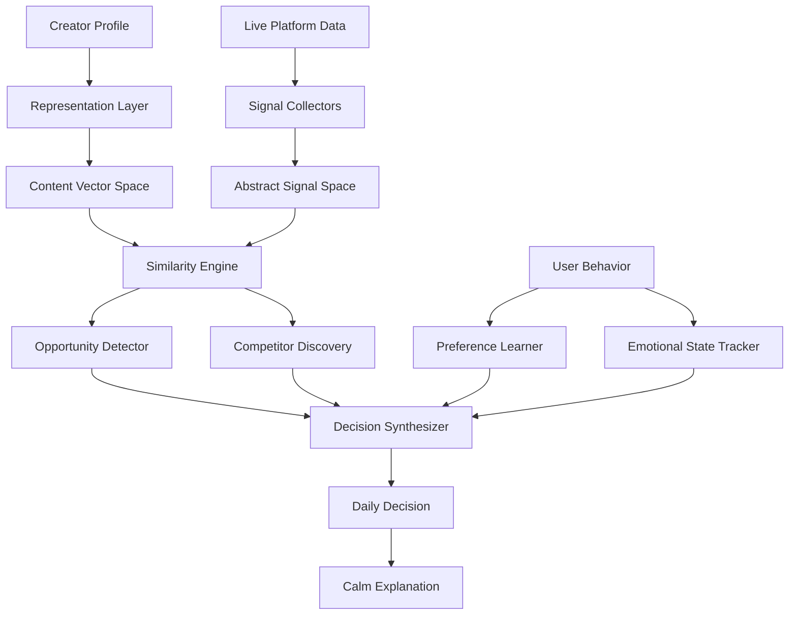

# 🧠 Decision Assistant: Production Architecture
## A Calm, Protective Intelligence System for Content Creators

**Design Philosophy**: Nothing hardcoded. Everything learned. Always calm.

---

## 📐 SYSTEM ARCHITECTURE OVERVIEW



---

## 🏗️ LAYER 1: REPRESENTATION LAYER
### Purpose: Transform everything into comparable vectors

### 1.1 Content Representation Engine

**Input**: Any creator profile (Instagram, YouTube, X, etc.)  
**Output**: Multi-dimensional embedding vector

```python
class ContentRepresentationEngine:
    """
    Transforms creator profiles into semantic embeddings.
    No hardcoded categories. Pure learned representations.
    """
    
    def __init__(self):
        # Use pre-trained sentence transformer (frozen)
        self.encoder = SentenceTransformer('all-MiniLM-L6-v2')
        
        # Dimension reducers for different signal types
        self.theme_projector = None  # PCA/UMAP for theme space
        self.tone_projector = None   # Separate projection for tone
        self.format_projector = None # Format patterns
        
    def analyze_creator(self, profile_data: Dict) -> CreatorEmbedding:
        """
        Build multi-faceted representation of a creator.
        
        Args:
            profile_data: {
                'bio': str,
                'recent_posts': List[str],  # titles/captions
                'post_metadata': List[Dict],  # engagement, format
                'platform': str
            }
        
        Returns:
            CreatorEmbedding with multiple vector spaces
        """
        
        # 1. THEME VECTOR (what they talk about)
        content_texts = [profile_data['bio']] + profile_data['recent_posts']
        theme_embedding = self._encode_themes(content_texts)
        
        # 2. TONE VECTOR (how they communicate)
        tone_embedding = self._encode_tone(content_texts)
        
        # 3. FORMAT VECTOR (how they structure content)
        format_embedding = self._encode_formats(profile_data['post_metadata'])
        
        # 4. TRAJECTORY VECTOR (growth pattern)
        trajectory_embedding = self._encode_trajectory(profile_data['post_metadata'])
        
        return CreatorEmbedding(
            theme=theme_embedding,
            tone=tone_embedding,
            format=format_embedding,
            trajectory=trajectory_embedding,
            metadata={
                'platform': profile_data['platform'],
                'analyzed_at': datetime.utcnow(),
                'post_count': len(profile_data['recent_posts'])
            }
        )
    
    def _encode_themes(self, texts: List[str]) -> np.ndarray:
        """Extract semantic themes from content"""
        # Encode all texts
        embeddings = self.encoder.encode(texts)
        
        # Return centroid (average theme)
        return np.mean(embeddings, axis=0)
    
    def _encode_tone(self, texts: List[str]) -> np.ndarray:
        """
        Extract communication tone.
        Uses linguistic features: formality, emotion, complexity
        """
        features = []
        for text in texts:
            features.append({
                'avg_word_length': np.mean([len(w) for w in text.split()]),
                'sentence_count': text.count('.') + text.count('!') + text.count('?'),
                'question_ratio': text.count('?') / max(len(text), 1),
                'exclamation_ratio': text.count('!') / max(len(text), 1),
                'emoji_count': sum(1 for c in text if ord(c) > 127000)
            })
        
        # Convert to vector
        tone_vector = np.array([
            np.mean([f['avg_word_length'] for f in features]),
            np.mean([f['sentence_count'] for f in features]),
            np.mean([f['question_ratio'] for f in features]),
            np.mean([f['exclamation_ratio'] for f in features]),
            np.mean([f['emoji_count'] for f in features])
        ])
        
        return tone_vector
    
    def _encode_formats(self, post_metadata: List[Dict]) -> np.ndarray:
        """
        Extract format patterns.
        Examples: long-form, short clips, carousels, threads
        """
        format_features = {
            'avg_length': np.mean([p.get('length', 0) for p in post_metadata]),
            'media_ratio': np.mean([1 if p.get('has_media') else 0 for p in post_metadata]),
            'carousel_ratio': np.mean([1 if p.get('is_carousel') else 0 for p in post_metadata]),
            'video_ratio': np.mean([1 if p.get('is_video') else 0 for p in post_metadata])
        }
        
        return np.array(list(format_features.values()))
    
    def _encode_trajectory(self, post_metadata: List[Dict]) -> np.ndarray:
        """
        Encode growth trajectory.
        Rising, stable, declining, volatile
        """
        if len(post_metadata) < 3:
            return np.zeros(4)  # Not enough data
        
        # Sort by date
        sorted_posts = sorted(post_metadata, key=lambda x: x.get('date', ''))
        
        # Extract engagement over time
        engagement = [p.get('engagement_rate', 0) for p in sorted_posts]
        
        # Calculate trajectory features
        trend = np.polyfit(range(len(engagement)), engagement, 1)[0]  # Linear trend
        volatility = np.std(engagement)
        recent_avg = np.mean(engagement[-5:]) if len(engagement) >= 5 else np.mean(engagement)
        overall_avg = np.mean(engagement)
        
        return np.array([trend, volatility, recent_avg, overall_avg])
```

---

## 🏗️ LAYER 2: LIVE SIGNAL ABSTRACTION
### Purpose: Convert platform-specific data into universal signals

### 2.1 Abstract Signal Space

```python
class AbstractSignal:
    """
    Platform-agnostic representation of a content trend/topic.
    """
    
    def __init__(
        self,
        content_vector: np.ndarray,      # Semantic embedding
        momentum: float,                  # 0-1: rising/falling
        saturation: float,                # 0-1: how crowded
        recency: float,                   # 0-1: how fresh
        noise_level: float,               # 0-1: signal clarity
        source_platforms: List[str],      # Where detected
        evidence: List[Dict],             # Raw data points
        detected_at: datetime
    ):
        self.content_vector = content_vector
        self.momentum = momentum
        self.saturation = saturation
        self.recency = recency
        self.noise_level = noise_level
        self.source_platforms = source_platforms
        self.evidence = evidence
        self.detected_at = detected_at
        
        # Derived properties
        self.confidence = self._calculate_confidence()
        self.lifecycle_phase = self._infer_lifecycle()
    
    def _calculate_confidence(self) -> float:
        """
        Confidence based on:
        - Multiple source agreement
        - Low noise
        - Clear momentum
        """
        source_bonus = min(len(self.source_platforms) * 0.2, 0.6)
        noise_penalty = self.noise_level * 0.3
        clarity_bonus = abs(self.momentum - 0.5) * 0.4  # Clear direction
        
        return min(source_bonus - noise_penalty + clarity_bonus, 1.0)
    
    def _infer_lifecycle(self) -> str:
        """
        Infer where in lifecycle: emerging, accelerating, peak, declining
        """
        if self.momentum > 0.7 and self.saturation < 0.3:
            return "emerging"
        elif self.momentum > 0.6 and self.saturation < 0.6:
            return "accelerating"
        elif self.saturation > 0.7:
            return "saturated"
        elif self.momentum < 0.3:
            return "declining"
        else:
            return "stable"


class LiveSignalCollector:
    """
    Collects platform-specific data and maps to AbstractSignal.
    """
    
    def __init__(self):
        self.representation_engine = ContentRepresentationEngine()
        
        # Platform-specific collectors
        self.collectors = {
            'google_trends': GoogleTrendsCollector(),
            'google_news': GoogleNewsCollector(),
            'youtube': YouTubeCollector(),
            'instagram': InstagramCollector(),  # If available
        }
    
    def collect_signals(self, search_space: np.ndarray, radius: float = 0.3) -> List[AbstractSignal]:
        """
        Collect signals relevant to a content space.
        
        Args:
            search_space: Embedding vector representing content area
            radius: How far to search in semantic space
        
        Returns:
            List of AbstractSignals
        """
        all_signals = []
        
        for platform, collector in self.collectors.items():
            try:
                # Get raw platform data
                raw_signals = collector.collect_nearby(search_space, radius)
                
                # Convert to AbstractSignals
                for raw in raw_signals:
                    abstract_signal = self._abstract_signal(raw, platform)
                    all_signals.append(abstract_signal)
                    
            except Exception as e:
                logger.warning(f"Platform {platform} failed: {e}")
                continue
        
        # Merge duplicate signals from different platforms
        merged_signals = self._merge_cross_platform_signals(all_signals)
        
        return merged_signals
    
    def _abstract_signal(self, raw_data: Dict, platform: str) -> AbstractSignal:
        """Convert platform-specific data to AbstractSignal"""
        
        # Encode content
        content_text = raw_data.get('title', '') + ' ' + raw_data.get('description', '')
        content_vector = self.representation_engine.encoder.encode(content_text)
        
        # Calculate momentum (platform-specific logic)
        momentum = self._calculate_momentum(raw_data, platform)
        
        # Calculate saturation
        saturation = self._calculate_saturation(raw_data, platform)
        
        # Calculate recency
        recency = self._calculate_recency(raw_data)
        
        # Calculate noise
        noise = self._calculate_noise(raw_data, platform)
        
        return AbstractSignal(
            content_vector=content_vector,
            momentum=momentum,
            saturation=saturation,
            recency=recency,
            noise_level=noise,
            source_platforms=[platform],
            evidence=[raw_data],
            detected_at=datetime.utcnow()
        )
    
    def _merge_cross_platform_signals(self, signals: List[AbstractSignal]) -> List[AbstractSignal]:
        """
        Merge signals that represent the same topic across platforms.
        Uses vector similarity.
        """
        if not signals:
            return []
        
        # Cluster by similarity
        from sklearn.cluster import DBSCAN
        
        vectors = np.array([s.content_vector for s in signals])
        clustering = DBSCAN(eps=0.15, min_samples=1, metric='cosine').fit(vectors)
        
        merged = []
        for cluster_id in set(clustering.labels_):
            cluster_signals = [s for i, s in enumerate(signals) if clustering.labels_[i] == cluster_id]
            
            # Merge into single signal
            merged_signal = self._merge_signal_cluster(cluster_signals)
            merged.append(merged_signal)
        
        return merged
    
    def _merge_signal_cluster(self, signals: List[AbstractSignal]) -> AbstractSignal:
        """Merge multiple signals into one"""
        
        # Average vectors
        avg_vector = np.mean([s.content_vector for s in signals], axis=0)
        
        # Max momentum (most optimistic)
        max_momentum = max(s.momentum for s in signals)
        
        # Average saturation
        avg_saturation = np.mean([s.saturation for s in signals])
        
        # Max recency
        max_recency = max(s.recency for s in signals)
        
        # Min noise (best signal quality)
        min_noise = min(s.noise_level for s in signals)
        
        # Combine platforms
        all_platforms = list(set(p for s in signals for p in s.source_platforms))
        
        # Combine evidence
        all_evidence = [e for s in signals for e in s.evidence]
        
        return AbstractSignal(
            content_vector=avg_vector,
            momentum=max_momentum,
            saturation=avg_saturation,
            recency=max_recency,
            noise_level=min_noise,
            source_platforms=all_platforms,
            evidence=all_evidence,
            detected_at=max(s.detected_at for s in signals)
        )
```

---

## 🏗️ LAYER 3: COMPETITOR DISCOVERY ENGINE
### Purpose: Automatically find relevant competitors, no hardcoding

### 3.1 Dynamic Competitor Discovery

```python
class CompetitorDiscoveryEngine:
    """
    Discovers competitors purely through content similarity.
    No predefined lists. No manual categorization.
    """
    
    def __init__(self, vector_store: VectorStore):
        self.vector_store = vector_store  # FAISS or similar
        self.representation_engine = ContentRepresentationEngine()
    
    def discover_competitors(
        self,
        creator_embedding: CreatorEmbedding,
        k: int = 50,
        diversity_threshold: float = 0.3
    ) -> List[CompetitorProfile]:
        """
        Discover competitors using vector similarity.
        
        Args:
            creator_embedding: User's content representation
            k: Number of candidates to consider
            diversity_threshold: Minimum difference to be "different enough"
        
        Returns:
            Ranked list of competitors with relevance scores
        """
        
        # 1. Find nearest neighbors in theme space
        theme_neighbors = self.vector_store.search(
            creator_embedding.theme,
            k=k * 2  # Over-fetch for filtering
        )
        
        # 2. Filter by diversity (not too similar, not too different)
        candidates = []
        for neighbor in theme_neighbors:
            similarity = cosine_similarity(
                creator_embedding.theme,
                neighbor.embedding.theme
            )
            
            # Sweet spot: 0.6-0.9 similarity
            # Too similar (>0.9): direct clone
            # Too different (<0.6): not relevant
            if 0.6 <= similarity <= 0.9:
                candidates.append((neighbor, similarity))
        
        # 3. Rank by multiple factors
        ranked_competitors = self._rank_competitors(
            creator_embedding,
            candidates
        )
        
        return ranked_competitors[:20]  # Return top 20
    
    def _rank_competitors(
        self,
        creator_embedding: CreatorEmbedding,
        candidates: List[Tuple[CreatorProfile, float]]
    ) -> List[CompetitorProfile]:
        """
        Rank competitors by:
        - Relevance (theme similarity)
        - Aspirational distance (slightly ahead in growth)
        - Differentiation potential (different tone/format)
        """
        
        ranked = []
        for candidate, theme_similarity in candidates:
            
            # Calculate tone difference (want some difference)
            tone_diff = 1 - cosine_similarity(
                creator_embedding.tone,
                candidate.embedding.tone
            )
            
            # Calculate format difference
            format_diff = 1 - cosine_similarity(
                creator_embedding.format,
                candidate.embedding.format
            )
            
            # Calculate aspirational score (are they ahead?)
            trajectory_gap = (
                candidate.embedding.trajectory[2] -  # Their recent avg
                creator_embedding.trajectory[2]       # User's recent avg
            )
            aspirational_score = sigmoid(trajectory_gap)  # 0-1
            
            # Composite score
            relevance_score = theme_similarity * 0.5
            differentiation_score = (tone_diff + format_diff) / 2 * 0.3
            aspiration_score = aspirational_score * 0.2
            
            total_score = relevance_score + differentiation_score + aspiration_score
            
            ranked.append(CompetitorProfile(
                profile=candidate,
                relevance=theme_similarity,
                differentiation=differentiation_score,
                aspirational_distance=aspirational_score,
                total_score=total_score
            ))
        
        # Sort by total score
        ranked.sort(key=lambda x: x.total_score, reverse=True)
        
        return ranked
```

---

## 🏗️ LAYER 4: OPPORTUNITY DETECTION ENGINE
### Purpose: Find content gaps and timing windows

### 4.1 Opportunity Detector

```python
class OpportunityDetector:
    """
    Detects content opportunities by analyzing:
    - What's emerging vs saturated
    - What competitors are/aren't covering
    - What aligns with user's differentiation
    """
    
    def __init__(
        self,
        signal_collector: LiveSignalCollector,
        competitor_engine: CompetitorDiscoveryEngine
    ):
        self.signal_collector = signal_collector
        self.competitor_engine = competitor_engine
    
    def detect_opportunities(
        self,
        creator_embedding: CreatorEmbedding,
        competitors: List[CompetitorProfile],
        user_preferences: np.ndarray  # Learned preference vector
    ) -> List[Opportunity]:
        """
        Find opportunities for this creator.
        
        Returns:
            Ranked list of content opportunities
        """
        
        # 1. Collect live signals in creator's content space
        signals = self.signal_collector.collect_signals(
            search_space=creator_embedding.theme,
            radius=0.4  # Explore nearby topics
        )
        
        # 2. For each signal, calculate opportunity score
        opportunities = []
        for signal in signals:
            opp = self._evaluate_opportunity(
                signal,
                creator_embedding,
                competitors,
                user_preferences
            )
            opportunities.append(opp)
        
        # 3. Rank opportunities
        opportunities.sort(key=lambda x: x.total_score, reverse=True)
        
        return opportunities
    
    def _evaluate_opportunity(
        self,
        signal: AbstractSignal,
        creator_embedding: CreatorEmbedding,
        competitors: List[CompetitorProfile],
        user_preferences: np.ndarray
    ) -> Opportunity:
        """
        Evaluate a single signal as an opportunity.
        """
        
        # 1. TIMING SCORE (lifecycle phase)
        timing_score = self._score_timing(signal)
        
        # 2. DIFFERENTIATION SCORE (competitor gap)
        diff_score = self._score_differentiation(signal, competitors)
        
        # 3. ALIGNMENT SCORE (fits creator's style)
        alignment_score = cosine_similarity(
            signal.content_vector,
            creator_embedding.theme
        )
        
        # 4. PREFERENCE SCORE (user has shown interest)
        preference_score = cosine_similarity(
            signal.content_vector,
            user_preferences
        ) if user_preferences is not None else 0.5
        
        # 5. CONFIDENCE SCORE (signal quality)
        confidence_score = signal.confidence
        
        # Weighted combination
        total_score = (
            timing_score * 0.30 +
            diff_score * 0.25 +
            alignment_score * 0.20 +
            preference_score * 0.15 +
            confidence_score * 0.10
        )
        
        return Opportunity(
            signal=signal,
            timing_score=timing_score,
            differentiation_score=diff_score,
            alignment_score=alignment_score,
            preference_score=preference_score,
            confidence_score=confidence_score,
            total_score=total_score,
            lifecycle_phase=signal.lifecycle_phase,
            recommendation_type=self._determine_recommendation_type(signal, total_score)
        )
    
    def _score_timing(self, signal: AbstractSignal) -> float:
        """
        Score based on lifecycle phase.
        Best: emerging or early accelerating
        Worst: saturated or declining
        """
        phase_scores = {
            'emerging': 1.0,
            'accelerating': 0.8,
            'stable': 0.5,
            'saturated': 0.2,
            'declining': 0.1
        }
        
        base_score = phase_scores.get(signal.lifecycle_phase, 0.5)
        
        # Boost for high momentum + low saturation
        if signal.momentum > 0.7 and signal.saturation < 0.3:
            base_score *= 1.2
        
        # Penalize high saturation
        if signal.saturation > 0.7:
            base_score *= 0.5
        
        return min(base_score, 1.0)
    
    def _score_differentiation(
        self,
        signal: AbstractSignal,
        competitors: List[CompetitorProfile]
    ) -> float:
        """
        Score based on competitor coverage.
        High score = competitors aren't covering this yet
        """
        if not competitors:
            return 0.7  # Neutral if no competitors
        
        # Check how many competitors are covering this topic
        coverage_count = 0
        for comp in competitors[:10]:  # Top 10 competitors
            similarity = cosine_similarity(
                signal.content_vector,
                comp.profile.embedding.theme
            )
            if similarity > 0.7:  # They're covering it
                coverage_count += 1
        
        # Invert: fewer competitors = higher score
        coverage_ratio = coverage_count / min(len(competitors), 10)
        differentiation_score = 1 - coverage_ratio
        
        return differentiation_score
    
    def _determine_recommendation_type(
        self,
        signal: AbstractSignal,
        total_score: float
    ) -> str:
        """
        Determine what to recommend.
        """
        if total_score < 0.4:
            return "avoid"
        elif signal.lifecycle_phase == "saturated":
            return "avoid"
        elif signal.lifecycle_phase == "declining":
            return "avoid"
        elif total_score > 0.7 and signal.lifecycle_phase in ["emerging", "accelerating"]:
            return "post"
        elif total_score > 0.5:
            return "consider"
        else:
            return "observe"
```

---

## 🏗️ LAYER 5: PREFERENCE LEARNING ENGINE
### Purpose: Learn from behavior, not labels

### 5.1 Behavioral Preference Learner

```python
class PreferenceLearner:
    """
    Learns user preferences from actions, not questions.
    Implements continuous vector adaptation.
    """
    
    def __init__(self):
        self.user_vectors = {}  # user_id -> preference vector
        self.interaction_history = defaultdict(list)
    
    def initialize_user(self, user_id: str, creator_embedding: CreatorEmbedding):
        """Initialize preference vector from creator's own content"""
        self.user_vectors[user_id] = creator_embedding.theme.copy()
    
    def update_from_action(
        self,
        user_id: str,
        action: str,  # 'select', 'reject', 'ignore', 'follow', 'rest'
        content_vector: np.ndarray,
        context: Dict = None
    ):
        """
        Update preference vector based on user action.
        
        Actions:
        - select: User chose this recommendation → pull toward
        - reject: User dismissed → push away
        - ignore: User saw but didn't act → slight push away
        - follow: User followed advice → strong pull toward
        - rest: User took rest day → no update
        """
        
        if user_id not in self.user_vectors:
            self.user_vectors[user_id] = content_vector.copy()
            return
        
        current_vector = self.user_vectors[user_id]
        
        # Learning rates by action type
        learning_rates = {
            'select': 0.3,
            'follow': 0.4,   # Strongest signal
            'reject': -0.2,  # Push away
            'ignore': -0.1,  # Slight push away
            'rest': 0.0      # No update
        }
        
        alpha = learning_rates.get(action, 0.0)
        
        if alpha > 0:
            # Pull toward
            self.user_vectors[user_id] = (
                (1 - alpha) * current_vector +
                alpha * content_vector
            )
        elif alpha < 0:
            # Push away
            diff = content_vector - current_vector
            self.user_vectors[user_id] = current_vector - abs(alpha) * diff
        
        # Record interaction
        self.interaction_history[user_id].append({
            'action': action,
            'timestamp': datetime.utcnow(),
            'context': context
        })
    
    def get_preference_vector(self, user_id: str) -> Optional[np.ndarray]:
        """Get current preference vector"""
        return self.user_vectors.get(user_id)
    
    def infer_rest_patterns(self, user_id: str) -> Dict:
        """
        Infer when user tends to rest.
        Used to proactively suggest rest days.
        """
        history = self.interaction_history[user_id]
        
        if len(history) < 7:
            return {'confidence': 'low', 'pattern': None}
        
        # Analyze rest day patterns
        rest_actions = [h for h in history if h['action'] == 'rest']
        
        if len(rest_actions) < 2:
            return {'confidence': 'low', 'pattern': None}
        
        # Check for weekly patterns
        rest_days = [h['timestamp'].weekday() for h in rest_actions]
        most_common_day = Counter(rest_days).most_common(1)[0]
        
        if most_common_day[1] >= 2:  # At least 2 occurrences
            return {
                'confidence': 'medium',
                'pattern': 'weekly',
                'preferred_day': most_common_day[0]
            }
        
        return {'confidence': 'low', 'pattern': None}
```

---

## 🏗️ LAYER 6: DECISION SYNTHESIZER
### Purpose: Generate the daily decision with calm explanation

### 6.1 Daily Decision Generator

```python
class DecisionSynthesizer:
    """
    Generates ONE calm, clear daily decision.
    Prioritizes emotional safety over engagement.
    """
    
    def __init__(
        self,
        opportunity_detector: OpportunityDetector,
        preference_learner: PreferenceLearner,
        emotional_tracker: EmotionalStateTracker
    ):
        self.opportunity_detector = opportunity_detector
        self.preference_learner = preference_learner
        self.emotional_tracker = emotional_tracker
    
    def generate_daily_decision(
        self,
        user_id: str,
        creator_embedding: CreatorEmbedding,
        competitors: List[CompetitorProfile]
    ) -> DailyDecision:
        """
        Generate the daily decision.
        
        Returns:
            DailyDecision with action, explanation, and emotional context
        """
        
        # 1. Check emotional state
        emotional_state = self.emotional_tracker.get_state(user_id)
        
        # 2. Check if user needs rest
        if self._should_suggest_rest(user_id, emotional_state):
            return self._generate_rest_decision(emotional_state)
        
        # 3. Get preference vector
        preference_vector = self.preference_learner.get_preference_vector(user_id)
        
        # 4. Detect opportunities
        opportunities = self.opportunity_detector.detect_opportunities(
            creator_embedding,
            competitors,
            preference_vector
        )
        
        # 5. Select best opportunity (or none)
        best_opportunity = self._select_best_opportunity(opportunities, emotional_state)
        
        if best_opportunity is None:
            return self._generate_observe_decision(opportunities)
        
        # 6. Generate decision
        return self._generate_decision(best_opportunity, opportunities, emotional_state)
    
    def _should_suggest_rest(self, user_id: str, emotional_state: Dict) -> bool:
        """
        Decide if user should rest today.
        Based on:
        - Emotional fatigue
        - Recent posting frequency
        - Rest patterns
        """
        
        # Check emotional fatigue
        if emotional_state.get('anxiety_level', 0) > 0.7:
            return True
        
        # Check posting frequency
        recent_posts = emotional_state.get('posts_last_7_days', 0)
        if recent_posts >= 5:  # Posted 5+ times this week
            return True
        
        # Check rest patterns
        rest_pattern = self.preference_learner.infer_rest_patterns(user_id)
        if rest_pattern['confidence'] == 'medium':
            today = datetime.utcnow().weekday()
            if today == rest_pattern.get('preferred_day'):
                return True
        
        return False
    
    def _select_best_opportunity(
        self,
        opportunities: List[Opportunity],
        emotional_state: Dict
    ) -> Optional[Opportunity]:
        """
        Select best opportunity, or None if nothing good.
        """
        
        if not opportunities:
            return None
        
        # Filter by recommendation type
        postable = [o for o in opportunities if o.recommendation_type == "post"]
        
        if not postable:
            return None
        
        # Get top opportunity
        top = postable[0]
        
        # Conservative threshold: only recommend if score > 0.6
        if top.total_score < 0.6:
            return None
        
        # If user is anxious, require higher confidence
        if emotional_state.get('anxiety_level', 0) > 0.5:
            if top.confidence_score < 0.75:
                return None
        
        return top
    
    def _generate_decision(
        self,
        opportunity: Opportunity,
        all_opportunities: List[Opportunity],
        emotional_state: Dict
    ) -> DailyDecision:
        """
        Generate a POST decision with calm explanation.
        """
        
        # Generate explanation
        explanation = self._generate_calm_explanation(opportunity, emotional_state)
        
        # Find things to avoid
        avoid_topics = [o for o in all_opportunities if o.recommendation_type == "avoid"][:3]
        
        return DailyDecision(
            action="post",
            topic=self._extract_topic_name(opportunity.signal),
            confidence=opportunity.confidence_score,
            explanation=explanation,
            timing=self._suggest_timing(opportunity),
            alternatives=self._get_alternatives(all_opportunities, opportunity),
            avoid=self._format_avoid_list(avoid_topics),
            emotional_context={
                'tone': 'calm',
                'reassurance': self._generate_reassurance(opportunity, emotional_state)
            },
            metadata={
                'lifecycle_phase': opportunity.lifecycle_phase,
                'differentiation_score': opportunity.differentiation_score,
                'sources': opportunity.signal.source_platforms
            }
        )
    
    def _generate_calm_explanation(
        self,
        opportunity: Opportunity,
        emotional_state: Dict
    ) -> str:
        """
        Generate calm, conservative explanation.
        No hype. No pressure. Just facts.
        """
        
        signal = opportunity.signal
        
        # Start with observation
        explanation = f"Signals suggest interest is building around this topic. "
        
        # Add lifecycle context
        if signal.lifecycle_phase == "emerging":
            explanation += "It's in an early phase—most creators haven't covered it yet. "
        elif signal.lifecycle_phase == "accelerating":
            explanation += "Momentum is picking up, but it's not overcrowded yet. "
        
        # Add source context
        if len(signal.source_platforms) > 1:
            platforms = ", ".join(signal.source_platforms[:2])
            explanation += f"We're seeing alignment across {platforms}. "
        
        # Add differentiation context
        if opportunity.differentiation_score > 0.7:
            explanation += "Your competitors aren't covering this angle yet. "
        
        # Add uncertainty if present
        if signal.confidence < 0.7:
            explanation += "Confidence is moderate—signals are present but not overwhelming. "
        
        # Add calm reassurance
        if emotional_state.get('anxiety_level', 0) > 0.5:
            explanation += "This is a suggestion, not a requirement. Trust your instinct."
        
        return explanation
    
    def _generate_rest_decision(self, emotional_state: Dict) -> DailyDecision:
        """
        Generate a REST decision.
        """
        
        reasons = []
        if emotional_state.get('anxiety_level', 0) > 0.7:
            reasons.append("You've been pushing hard lately")
        if emotional_state.get('posts_last_7_days', 0) >= 5:
            reasons.append("You've posted frequently this week")
        
        reason_text = ". ".join(reasons) if reasons else "Sometimes the best move is to pause"
        
        return DailyDecision(
            action="rest",
            topic=None,
            confidence=1.0,
            explanation=f"{reason_text}. Taking a strategic rest day can help you return with clarity and energy.",
            timing=None,
            alternatives=[],
            avoid=[],
            emotional_context={
                'tone': 'supportive',
                'reassurance': "Rest is productive. Your audience will still be there tomorrow."
            },
            metadata={'reason': 'emotional_wellbeing'}
        )
    
    def _generate_observe_decision(self, opportunities: List[Opportunity]) -> DailyDecision:
        """
        Generate an OBSERVE decision when nothing is strong enough.
        """
        
        return DailyDecision(
            action="observe",
            topic=None,
            confidence=0.5,
            explanation="No strong signals detected right now. This is normal—trends come in waves. Consider engaging with your audience, reviewing past content, or simply observing what's happening in your space.",
            timing=None,
            alternatives=[],
            avoid=[o for o in opportunities if o.recommendation_type == "avoid"][:3],
            emotional_context={
                'tone': 'calm',
                'reassurance': "Not every day needs to be a posting day. Observation is valuable."
            },
            metadata={'reason': 'no_strong_signals'}
        )
```

---

## 🏗️ LAYER 7: EMOTIONAL STATE TRACKER
### Purpose: Monitor creator wellbeing and adapt recommendations

### 7.1 Emotional Intelligence Layer

```python
class EmotionalStateTracker:
    """
    Tracks creator's emotional state through behavioral signals.
    Never asks directly—infers from actions.
    """
    
    def __init__(self):
        self.user_states = {}
    
    def update_state(self, user_id: str, action: str, context: Dict):
        """
        Update emotional state based on action.
        
        Signals:
        - Rapid checking: anxiety
        - Ignoring recommendations: fatigue or misalignment
        - Following advice: trust building
        - Taking rest: self-awareness
        """
        
        if user_id not in self.user_states:
            self.user_states[user_id] = {
                'anxiety_level': 0.3,  # Start neutral
                'trust_level': 0.5,
                'fatigue_level': 0.0,
                'posts_last_7_days': 0,
                'last_rest_day': None,
                'interaction_frequency': []
            }
        
        state = self.user_states[user_id]
        
        # Update based on action
        if action == 'follow':
            state['trust_level'] = min(state['trust_level'] + 0.1, 1.0)
            state['anxiety_level'] = max(state['anxiety_level'] - 0.05, 0.0)
        
        elif action == 'ignore':
            state['fatigue_level'] = min(state['fatigue_level'] + 0.1, 1.0)
        
        elif action == 'rest':
            state['fatigue_level'] = max(state['fatigue_level'] - 0.3, 0.0)
            state['last_rest_day'] = datetime.utcnow()
        
        elif action == 'rapid_check':
            state['anxiety_level'] = min(state['anxiety_level'] + 0.1, 1.0)
        
        # Track interaction frequency
        state['interaction_frequency'].append(datetime.utcnow())
        
        # Keep only last 30 days
        cutoff = datetime.utcnow() - timedelta(days=30)
        state['interaction_frequency'] = [
            t for t in state['interaction_frequency'] if t > cutoff
        ]
    
    def get_state(self, user_id: str) -> Dict:
        """Get current emotional state"""
        return self.user_states.get(user_id, {
            'anxiety_level': 0.3,
            'trust_level': 0.5,
            'fatigue_level': 0.0,
            'posts_last_7_days': 0
        })
```

---

## 📊 COMPLETE SYSTEM FLOW

```python
class DecisionAssistant:
    """
    Main orchestrator. Brings all layers together.
    """
    
    def __init__(self):
        # Initialize all engines
        self.representation_engine = ContentRepresentationEngine()
        self.signal_collector = LiveSignalCollector()
        self.vector_store = VectorStore()  # FAISS
        self.competitor_engine = CompetitorDiscoveryEngine(self.vector_store)
        self.opportunity_detector = OpportunityDetector(
            self.signal_collector,
            self.competitor_engine
        )
        self.preference_learner = PreferenceLearner()
        self.emotional_tracker = EmotionalStateTracker()
        self.decision_synthesizer = DecisionSynthesizer(
            self.opportunity_detector,
            self.preference_learner,
            self.emotional_tracker
        )
    
    async def onboard_creator(self, user_id: str, profile_data: Dict) -> Dict:
        """
        Onboard a new creator.
        No questions asked—just analyze their content.
        """
        
        # 1. Analyze creator's content
        creator_embedding = self.representation_engine.analyze_creator(profile_data)
        
        # 2. Store in vector database
        await self.vector_store.add_creator(user_id, creator_embedding)
        
        # 3. Initialize preference vector
        self.preference_learner.initialize_user(user_id, creator_embedding)
        
        # 4. Discover initial competitors
        competitors = self.competitor_engine.discover_competitors(creator_embedding)
        
        return {
            'status': 'success',
            'creator_profile': creator_embedding.to_dict(),
            'suggested_competitors': [c.to_dict() for c in competitors[:10]]
        }
    
    async def get_daily_decision(self, user_id: str) -> DailyDecision:
        """
        Generate daily decision for a creator.
        """
        
        # 1. Get creator embedding
        creator_embedding = await self.vector_store.get_creator(user_id)
        
        # 2. Get competitors (cached or re-discovered)
        competitors = await self._get_competitors(user_id, creator_embedding)
        
        # 3. Generate decision
        decision = self.decision_synthesizer.generate_daily_decision(
            user_id,
            creator_embedding,
            competitors
        )
        
        return decision
    
    async def record_action(self, user_id: str, action: str, context: Dict):
        """
        Record user action and update learning systems.
        """
        
        # Update preference learner
        if 'content_vector' in context:
            self.preference_learner.update_from_action(
                user_id,
                action,
                context['content_vector'],
                context
            )
        
        # Update emotional tracker
        self.emotional_tracker.update_state(user_id, action, context)
```

---

## 🎯 KEY DESIGN DECISIONS

### 1. **No Hardcoding**
- All niches discovered through clustering
- All competitors found through similarity
- All preferences learned through behavior

### 2. **Emotional Safety First**
- Rest days are valid recommendations
- Anxiety detection through behavior
- Conservative confidence thresholds
- Calm, non-pressuring language

### 3. **Live Data Only**
- All signals from real platforms
- Graceful degradation if sources fail
- Cross-platform signal merging

### 4. **Continuous Learning**
- Preference vectors updated with each action
- Emotional state tracked passively
- No explicit user feedback required

### 5. **Explainability**
- Every decision has a calm explanation
- References signals, not algorithms
- Acknowledges uncertainty

---

This architecture embodies your vision: calm, protective, adaptive, and emotionally intelligent.
